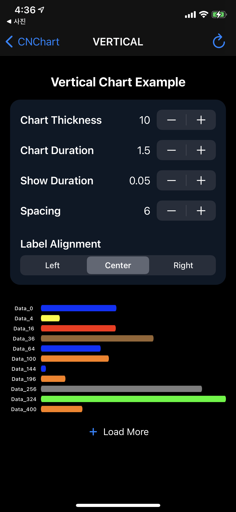

# CNChart

[](https://cocoapods.org/pods/CNChart)
[](https://swift.org/package-manager/)
[](https://cocoapods.org/pods/CNChart)
[](https://cocoapods.org/pods/CNChart)

**CNChart** is an open source library making it easy to create beautiful, highly customizable, animated Bar Chart for iOS. 

## Project Details
Learn more about the **CNChart** project, licensing, support etc.

<p align="center"></p>

## Example Project

To run the example project, clone the repo, and run `pod install` from the Example directory first.

## Requirements
 - Requires iOS 9 or later. The sample project is optimized for iOS 13.
 - Requires Automatic Reference Counting (ARC).
 - Optimized for ARM64 Architecture.


## Getting Started
It only takes a few simple steps to install and setup **CNChart** to your project.

## Installation

### Swift Package Manager
Add `https://github.com/Chanooo/CNChart` as a dependency to your Package.swift file or select `File -> Swift Packages -> Add Package Dependency...` in Xcode.

### CocoaPods
The easiest way to install **CNChart** is to use <a href="http://cocoapods.org/" target="_blank">CocoaPods</a>. To do so, simply add the following line to your `Podfile`:
```ruby
pod 'CNChart'
```


<!-- [](https://gitter.im/Chanooo/CNChart)  
Join us on [Gitter](https://gitter.im/Chanooo/CNChart) if you need any help or want to talk about the project. -->

## Author & Contacts

iOS Developer CNOO, kcw9028@naver.com

## License

CNChart is available under the MIT license. See the LICENSE file for more info.
See the [License](https://github.com/Chanooo/CNChart/blob/master/LICENSE). You are free to make changes and use this in either personal or commercial projects. Attribution is not required, but highly appreciated. A little "Thanks!" (or something to that affect) is always welcome. If you use **CNChart** in your app, please let me know!