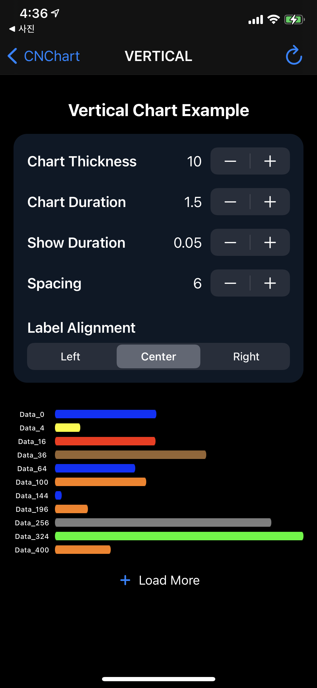
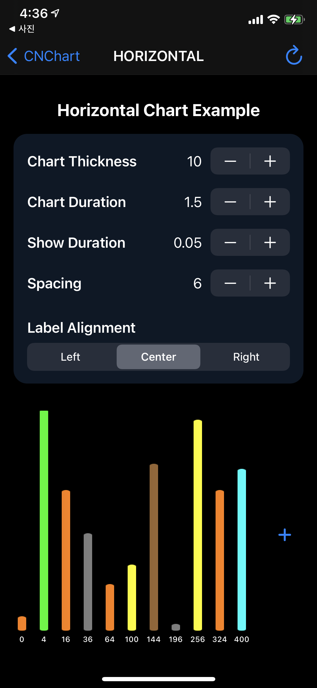

## 😱 Now updating 'VERY KIND' ReadMe file. This work will be end up before October 1, 2021
### 😍 Thank you for using my CNChart Library.
</br>

# CNChart
[](https://cocoapods.org/pods/CNChart)
[](https://swift.org/package-manager/)
[](https://cocoapods.org/pods/CNChart)
[](https://cocoapods.org/pods/CNChart)

**CNChart** is an open source library making it easy to create beautiful, highly customizable, animated Bar Chart for iOS. 


## Table of Contents

* [**Screenshots**](#screenshots)  
* [**Project Details**](#project-details)  
  * [Requirements](#requirements)
  * [License](#license)
  * [Sample App](#sample-app)
* [**Getting Started**](#getting-started)
  * [Installation](#installation)
  * [Setup](#setup)
* [**Documentation**](#documentation)
  <!-- * [Enabling / Disabling the Checkbox](#enabling--disabling-the-checkbox) 
  * [Reloading](#reloading)
  * [Group / Radio Button Functionality](#group--radio-button-functionality) -->
  * [Delegate](#delegate)
  * [Customization](#customization)

## Project Details
Learn more about the **CNChart** project, licensing, support etc.

## Example Project
An Example Project shows up how to use, and what things you can costomize.</br>
Sample images of example project are blow.


## Screenshots & GIFs
<table>
<tr height="60px" align="center">
  <!-- <td width="20%"><strong>KafkaRefreshStyle</strong></td> -->
  <td width="50%"><strong>Vertical Style</strong></td>
  <td width="50%"><strong>Horizontal Style</strong></td>
</tr>
<tr align="center" height="120px">
  <!-- <td width="300px">Native</td> -->
  <td></img></td>
  <td></img></td>
</tr>
</table>
</br></br>

## Requirements
 - Requires iOS 9 or later. The sample project is optimized for iOS 13.
 - Requires Automatic Reference Counting (ARC).
 - Optimized for ARM64 Architecture.
</br>

## Getting Started
It only takes a few simple steps to install and setup **CNChart** to your project.
</br>

## Installation

### Swift Package Manager
Add `https://github.com/Chanooo/CNChart` as a dependency to your Package.swift file or select `File -> Swift Packages -> Add Package Dependency...` in Xcode.

### CocoaPods
The easiest way to install **CNChart** is to use <a href="http://cocoapods.org/" target="_blank">CocoaPods</a>. To do so, simply add the following line to your `Podfile`:
```ruby
pod 'CNChart'
```


 **Programmatical Initialization**  
 Just add the following code to your implementation (usually in the `viewDidLoad` method of your View Controller).

 ``` swift
let chart = CNChart(axis: .horizontal) // or .vertical
self.view.addSubview(chart)
 ```
 
 **Interface Builder Initialization**  
 1 - Drag a `UIStackView (Horizontal or Vertical)` to your `UIViewController`.  
 2 - Change the class of the new `UIStackView` to `CNChart`.  
 3 - (Option) If interface builder occurs an error, you could put fixed sized UIView inside of UIStackView.  
 4 - Select the `CNChart` and open the Attributes Inspector. Most of the customizable properties can easily be set from the Attributes Inspector. The Sample App demonstrates this capability.

<br/>


<!-- [](https://gitter.im/Chanooo/CNChart)  
Join us on [Gitter](https://gitter.im/Chanooo/CNChart) if you need any help or want to talk about the project. -->

## Author & Contacts

iOS Developer CNOO, kcw9028@naver.com
<br/>

## License

CNChart is available under the MIT license. See the LICENSE file for more info.
See the [License](https://github.com/Chanooo/CNChart/blob/master/LICENSE). You are free to make changes and use this in either personal or commercial projects. Attribution is not required, but highly appreciated. A little "Thanks!" (or something to that affect) is always welcome. If you use **CNChart** in your app, please let me know!